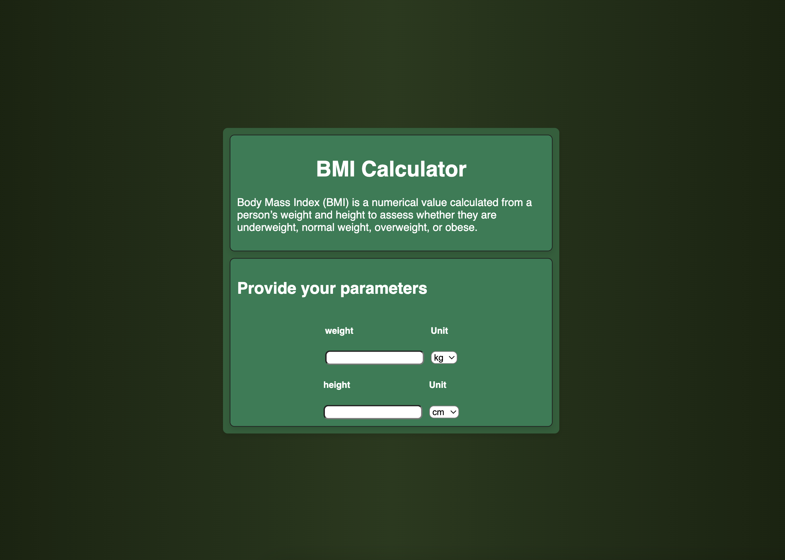
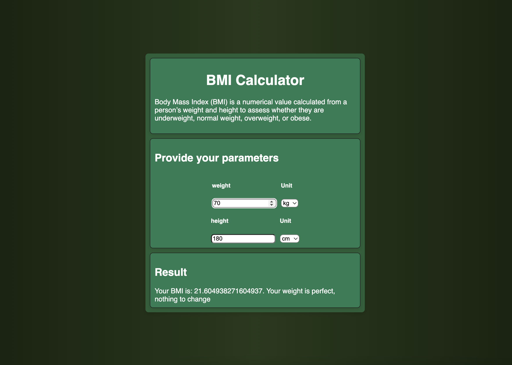
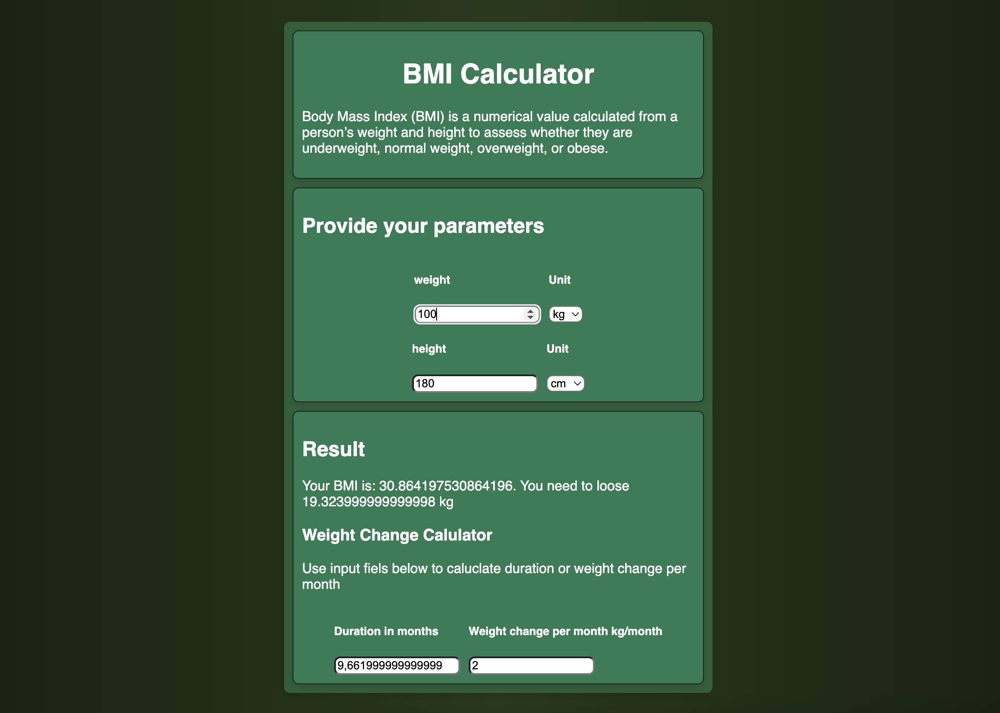

# Goal for this project  
Practice basic concepts of React (state, conditional rendering, etc.) and other web technologies—JavaScript, CSS, and HTML.  

This goal was definitely achieved. It was a good opportunity to put newly learned skills into practice without spending too much time on design.  
# About  
It's a simple BMI calculator that detects when BMI is outside the optimal range and plans how many kilograms the user should lose (or gain) per month to reach an optimal weight within a given time period.
# Using 
1. run "npm install" 
2. run "npm run dev" 
3. appropriate link will be pasted into console
# Result

# used colour palet:
https://colorhunt.co/palette/18230f27391c255f381f7d53